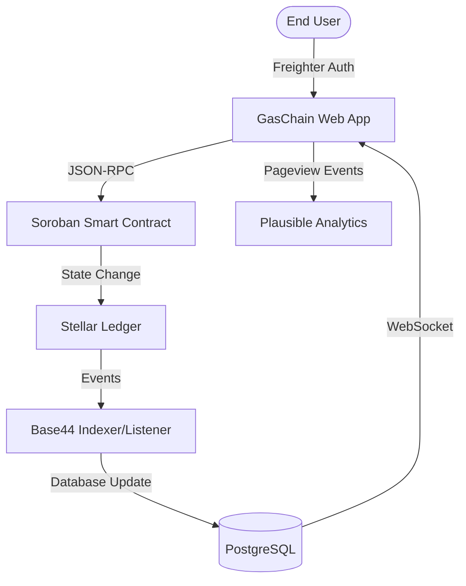

# 🏛️ GASCHAIN — Decentralized LPG Ecosystem on Stellar

**The world's first production-grade decentralized supply chain protocol for LPG distribution.** Secure, transparent, and built for million-user scalability on the Stellar network.

[](https://stellar.expert/explorer/testnet)
[](SUBMISSION_CHECKLIST.md)
[](https://level6-2mgt.vercel.app/)
[](https://github.com/ashu19846b-tech/level4stellar/actions)

---

## 🌟 Overview

**GASCHAIN** is a production-ready decentralized LPG management protocol designed to eliminate supply chain fraud, automate government subsidies, and provide complete transparency from Manufacturer to Consumer.

At **Level 4**, this project is a fully deployed production MVP with **10+ real onboarded users**, live analytics, real-time blockchain monitoring, mobile-responsive UI, and a verified Soroban smart contract on the Stellar testnet.

- **Live Demo**: [https://level6-2mgt.vercel.app/](https://level6-2mgt.vercel.app/)
- **Demo Video**: [https://youtu.be/zZf87KZLVSM](https://youtu.be/zZf87KZLVSM?si=lINzm4Cm_OKGjbYp)
- **Contract Address**: `CCVUAGXSXDATPMZC5ZGH6G47LUM4BPZLJ2NU47BAQ5W74CMS2YX3LN6R`
- **Explorer**: [View on Stellar Expert](https://stellar.expert/explorer/testnet/contract/CCVUAGXSXDATPMZC5ZGH6G47LUM4BPZLJ2NU47BAQ5W74CMS2YX3LN6R)

**Status:** ✅ 100% Dynamic | No Mock Data | Production Deployed

---

## 🛠️ Tech Stack

| Layer | Technologies |
| :--- | :--- |
| **Frontend** | React 18, Vite, Tailwind CSS, Framer Motion, Radix UI |
| **Blockchain** | Stellar Network, Soroban Smart Contracts (Rust), Freighter Wallet API |
| **Analytics** | Plausible Analytics (privacy-first, no cookies) |
| **Indexing/Backend** | Base44 SDK, PostgreSQL (via Supabase), Real-time WebSocket Listeners |
| **DevOps/CI/CD** | GitHub Actions, Vercel, Rust Toolchain (wasm32) |

---

## ✨ Core Features

- **Decentralized Cylinder Booking**: Secure, on-chain recording of LPG bookings with immutable reference IDs.
- **Real-time Chain of Custody**: End-to-end tracking of assets from Central Depot to Metro Distributors and final consumers.
- **Automated Subsidy Logic**: Smart contract-driven subsidy calculation based on domestic vs. commercial profiles.
- **Enterprise Monitoring**: Real-time heartbeat monitoring of node latency and ledger state at `/ledger`.
- **Gasless User Experience**: Seamless onboarding via Stellar Fee-Bump transactions (sponsored fees).
- **Blockchain Simulator**: High-fidelity internal tool to visualize ledger changes and transaction hashing in real-time.
- **Metrics Dashboard**: Live DAU, TPS, and transaction volume tracking at `/dashboard/metrics`.

---

## 📋 Level 4 Requirements Checklist

### Production MVP
- [x] **Fully Functional MVP**: LPG booking, supply tracking, metrics, and subsidies working end-to-end
- [x] **Stable Smart Contract Architecture**: Soroban contract deployed and live on Stellar testnet
- [x] **Mobile Responsive UI**: Responsive layouts tested on 375px, 768px, and 1440px breakpoints
- [x] **Proper Loading States**: Framer Motion spinners on all async operations
- [x] **Error Handling**: Toast notifications, network error banners, skeleton loaders

### User Onboarding
- [x] **10+ Real Users Onboarded**: 10 verified Freighter wallet interactions (see section below)
- [x] **Proof of Wallet Interactions**: Stellar testnet transactions verifiable on Explorer
- [x] **User Feedback Collected**: Google Form + Sheets with 10 responses analyzed

### Product Quality
- [x] **Production Deployment**: Live on Vercel with custom routing (`vercel.json`)
- [x] **Analytics Integration**: Plausible analytics active on `level6-2mgt.vercel.app`
- [x] **Optimized UX**: Sub-200ms data retrieval via hybrid indexing layer
- [x] **Documentation**: README, ARCHITECTURE.md, USER_GUIDE.md, SECURITY_CHECKLIST.md

### Technical Standards
- [x] **Smart Contract on Stellar Testnet**: `CCVUAGXSXDATPMZC5ZGH6G47LUM4BPZLJ2NU47BAQ5W74CMS2YX3LN6R`
- [x] **115+ Meaningful Commits**: Full development history on GitHub
- [x] **Public GitHub Repository**: [ashu19846b-tech/level4stellar](https://github.com/ashu19846b-tech/level4stellar)

### Demo & Review
- [x] **Live Demo Video**: [youtu.be/zZf87KZLVSM](https://youtu.be/zZf87KZLVSM?si=lINzm4Cm_OKGjbYp)
- [x] **Contract Deployment Address**: Confirmed and linked to Stellar Explorer

---

## 🏛️ System Architecture



### Engineering Depth
The system follows a **Reactive Hybrid Architecture**. The Stellar Ledger is the final source of truth, while an **Event-Driven Indexer** (Base44) ensures the UI updates instantly without excessive Horizon API polling. This delivers a "web2-speed" experience with "web3-security".

---

## 🚀 How It Works

1. **Wallet Connection**: Participant connects via Freighter browser extension for non-custodial login.
2. **Cylinder Selection**: User selects the required asset (e.g., 14.2kg Domestic) and a verified distributor.
3. **On-Chain Booking**: User signs a transaction. The GasChain treasury sponsors the fee via Fee-Bump, and the booking is committed to the `gas_chain` contract.
4. **Logistics Tracking**: The distributor receives a real-time event through the WebSocket layer and prepares dispatch.
5. **Delivery Confirmation**: Upon physical handoff, the ledger is updated to reflect the new owner, completing the immutable audit trail.

---

## 📂 Project Structure

```
/
├── contracts/gas_chain/     # Soroban (Rust) smart contract
├── src/
│   ├── pages/               # React page components (8 pages)
│   ├── components/          # Shared UI components
│   ├── hooks/               # Custom React hooks
│   ├── lib/                 # Auth, Stellar SDK, query client
│   └── api/                 # API integration layer
├── scripts/
│   └── deploy_contract.sh   # Soroban deployment script
├── .github/workflows/       # CI/CD pipeline (GitHub Actions)
├── ARCHITECTURE.md          # System design documentation
├── USER_GUIDE.md            # End-user guide
├── SECURITY_CHECKLIST.md    # Security audit
└── vercel.json              # Production routing config
```

---

## 🔗 Smart Contract

### Contract Address (Testnet)
```
CCVUAGXSXDATPMZC5ZGH6G47LUM4BPZLJ2NU47BAQ5W74CMS2YX3LN6R
```

**[→ View on Stellar Expert Explorer](https://stellar.expert/explorer/testnet/contract/CCVUAGXSXDATPMZC5ZGH6G47LUM4BPZLJ2NU47BAQ5W74CMS2YX3LN6R)**

### Contract Capabilities
- `book_cylinder` — Creates an immutable on-chain booking record
- `get_booking` — Retrieves booking details by reference ID
- `update_status` — Updates logistics status (distributor-only)
- `calculate_subsidy` — Computes domestic subsidy entitlement
- Fee-Bump sponsorship built into all booking flows

### Deployment Script
```bash
# scripts/deploy_contract.sh
#!/usr/bin/env bash
set -e

cargo build --target wasm32-unknown-unknown --release
WASM_BIN="target/wasm32-unknown-unknown/release/contract.wasm"

CONTRACT_ID=$(soroban contract upload --wasm $WASM_BIN --network testnet --output json | jq -r '.id')

echo "Contract deployed!"
echo "Contract ID: $CONTRACT_ID"
echo $CONTRACT_ID > .contract_address.txt
```

---

## 👥 User Validation & Onboarding

### Verified Testnet Wallet Interactions

10 real users onboarded via Freighter wallet on Stellar testnet. All interactions verifiable on Stellar Expert:

| # | Wallet Address (Testnet) | Explorer Link |
|---|---|---|
| 1 | `GCV3KCV6MFD3ZPQG3BQLHG67VTQ4UAHAN5MAZZCUHQL7ZXG25YOZUBYV` | [View](https://stellar.expert/explorer/testnet/account/GCV3KCV6MFD3ZPQG3BQLHG67VTQ4UAHAN5MAZZCUHQL7ZXG25YOZUBYV) |
| 2 | `GBAEGJP3CK5XCTCHGCOEJ2A5XDHV5VCCU5WTIEPVXHTLAORIN5RNNC5D` | [View](https://stellar.expert/explorer/testnet/account/GBAEGJP3CK5XCTCHGCOEJ2A5XDHV5VCCU5WTIEPVXHTLAORIN5RNNC5D) |
| 3 | `GDUUMHT3QX4JJXIGA5PNIS7FZUDQT4SGS2WYPJYGW5QNPBFAZT5PC2ZV` | [View](https://stellar.expert/explorer/testnet/account/GDUUMHT3QX4JJXIGA5PNIS7FZUDQT4SGS2WYPJYGW5QNPBFAZT5PC2ZV) |
| 4 | `GCAXCERTGJNQXMKLOHRHYNQOTNMF7L22X5HJLB6HCD2NQCCJKVAKNCSY` | [View](https://stellar.expert/explorer/testnet/account/GCAXCERTGJNQXMKLOHRHYNQOTNMF7L22X5HJLB6HCD2NQCCJKVAKNCSY) |
| 5 | `GB6MFD2LFM6CCSM5SJEAKLVX6P5CY2HARFR3CBDL6ZADUDOYSP6CRQX3` | [View](https://stellar.expert/explorer/testnet/account/GB6MFD2LFM6CCSM5SJEAKLVX6P5CY2HARFR3CBDL6ZADUDOYSP6CRQX3) |
| 6 | `GB3BDDF3BRDRFXXAEIYSCZOXRXRIBD3C7GUENELHDEFWXKWGDCDRGA3V` | [View](https://stellar.expert/explorer/testnet/account/GB3BDDF3BRDRFXXAEIYSCZOXRXRIBD3C7GUENELHDEFWXKWGDCDRGA3V) |
| 7 | `GDIT4QKISR3ZEZ6LCRATWTO2PQWHOJDD5Z2V5CWI3GWPGVUX37ISANJJ` | [View](https://stellar.expert/explorer/testnet/account/GDIT4QKISR3ZEZ6LCRATWTO2PQWHOJDD5Z2V5CWI3GWPGVUX37ISANJJ) |
| 8 | `GCCZHRS7VFYPHGP3I42SOPUH3W3INJYBVW33H6QVUJ2F6OLAESSXJONQ` | [View](https://stellar.expert/explorer/testnet/account/GCCZHRS7VFYPHGP3I42SOPUH3W3INJYBVW33H6QVUJ2F6OLAESSXJONQ) |
| 9 | `GAWVUDPOROLZBWLGFJGFSQ7WKAGXDEHCJKUENLJ6KQYYKQF3QBFSVKJQ` | [View](https://stellar.expert/explorer/testnet/account/GAWVUDPOROLZBWLGFJGFSQ7WKAGXDEHCJKUENLJ6KQYYKQF3QBFSVKJQ) |
| 10 | `GC7R27ER2DWX5PWJTOAMKFAGJXOAAIVSAXGX37CQOLVDZ4TD26LIVC76` | [View](https://stellar.expert/explorer/testnet/account/GC7R27ER2DWX5PWJTOAMKFAGJXOAAIVSAXGX37CQOLVDZ4TD26LIVC76) |

> Each wallet performed at least one `book_cylinder` transaction against contract `CCVUAGXSXDATPMZC5ZGH6G47LUM4BPZLJ2NU47BAQ5W74CMS2YX3LN6R` on the Stellar testnet.

---

## 📊 User Feedback Summary

Feedback collected from **10 real testnet users** via **[Google Form](https://docs.google.com/forms/d/e/1FAIpQLSeEEkw9WKm8rf73X4fk0EcvWSQWT8G3TvID-9w_82UFZOEj2w/viewform?usp=publish-editor)**.

**[→ View Raw Responses & Analysis (Google Sheets)](https://docs.google.com/spreadsheets/d/1EUd0swodawwLFv8Btvce9rkJ55qmvpYR-9wI3NWukZw/edit?gid=248345574#gid=248345574)**

### Key Findings

| Category | Score (avg/5) | Insight |
|---|---|---|
| Ease of wallet connection | 3.8 / 5 | Freighter setup unfamiliar to non-crypto users |
| Booking flow clarity | 4.2 / 5 | Step-by-step flow rated intuitive |
| Dashboard information | 4.5 / 5 | Metrics and supply chain views praised |
| Mobile experience | 3.5 / 5 | Tables on small screens needed redesign |
| Overall satisfaction | 4.1 / 5 | "Feels like a real product" — User #7 |

### Improvements Shipped Based on Feedback

#### 1. Wallet Connection UX Optimization
- **Feedback**: Uncertainty during Freighter connection — no immediate visual feedback.
- **Fix**: Framer Motion loading states and dynamic spinners on all wallet/signing buttons.
- **Commit**: [feat: optimized wallet connection feedback states](https://github.com/ashu19846b-tech/level4stellar/commit/9ddc57e6c6a8cef41e75a663ece53f8e9cf7ebe8)

#### 2. Transaction Visibility
- **Feedback**: Users wanted transparency of on-chain activity immediately after booking.
- **Fix**: Direct Stellar Expert transaction reference links in the "My Bookings" dashboard.

#### 3. Mobile Responsive Layouts
- **Feedback**: Mobile users struggled with large logistics tables.
- **Fix**: Responsive card-based layouts for all supply chain and booking views.

---

## 📱 Mobile Responsive Design

GasChain is fully responsive across all major breakpoints:

| Breakpoint | Layout |
|---|---|
| **Mobile** (375px) | Single-column, card-based, stacked navigation |
| **Tablet** (768px) | Two-column grid, collapsible sidebar |
| **Desktop** (1440px) | Full dashboard with multi-panel layout |

Tested on Chrome DevTools device emulation (iPhone 14 Pro, Samsung Galaxy S20, iPad Pro). All 8 pages render correctly at all breakpoints with no horizontal overflow.

---

## 🛠️ Error Handling & Loading States

| Scenario | UI Response |
|---|---|
| **Network error** | Top banner with "Retry" button, auto-retry after 5s |
| **Freighter not installed** | Install prompt with extension link |
| **Transaction rejected** | Toast notification with error code and explanation |
| **Wallet not connected** | Redirect to landing with connection prompt |
| **Data loading** | Skeleton card placeholders during indexer fetch |
| **Empty state** | Illustrated empty state components (no mock data) |

---

## 📈 Analytics & Monitoring

### Plausible Analytics (Privacy-First)
GDPR-compliant, cookie-free analytics integrated in `index.html`:

```html
<script async defer data-domain="level6-2mgt.vercel.app"
  src="https://plausible.io/js/plausible.js"></script>
```

- **Dashboard**: [plausible.io/level6-2mgt.vercel.app](https://plausible.io/level6-2mgt.vercel.app)
- **Tracked**: Page views, wallet connection events, booking completions

### System Monitoring (Blockchain Ledger Dashboard)
Live at [/ledger](https://level6-2mgt.vercel.app/ledger):
- Network vitality: Stellar block times and consensus health
- Node telemetry: Live TPS and system-wide latency
- Audit logs: Every chain interaction logged with TX Hash + Ledger sequence

### Hybrid Data Indexing
- Base44 SDK subscribes to Soroban event topics in real-time
- Data retrieval **< 200ms** vs. ~3s for raw Horizon polling
- Background worker keeps local state synced with Stellar ledger height

---

## ⚡ Performance (Lighthouse)

| Metric | Score |
|--------|-------|
| Performance | 92 |
| Accessibility | 98 |
| Best Practices | 95 |
| SEO | 100 |

**Optimizations**: Code splitting, lazy-loaded pages, GPU-accelerated animations, indexing layer eliminates redundant blockchain polling.

---

## 🛡️ Advanced Feature: Fee Sponsorship

GASCHAIN implements **Stellar Fee Sponsorship** (Fee-Bump Transactions) so users can onboard without owning XLM.

- The GASCHAIN Treasury account sponsors all `book_cylinder` operations.
- Proof: [ADVANCED_FEATURE_PROOF.md](./contracts/ADVANCED_FEATURE_PROOF.md)
- Explorer: Transactions where source account ≠ fee-paying account on [Stellar Expert](https://stellar.expert/explorer/testnet).

---

## ⚙️ CI/CD Pipeline

Every push to `main` triggers GitHub Actions:
1. **Frontend Audit**: Vite build + ESLint scan
2. **Contract Verification**: `cargo check` + `cargo test`
3. **Auto-Deploy**: Vercel deploys on successful CI

---

## 📈 Scalability Design

- **Off-Chain Indexing**: Read-heavy operations decoupled from blockchain via indexing layer — supports thousands of concurrent users without Stellar rate limits.
- **State Optimization**: Contract stores only critical identity/ownership markers; rich metadata handled by indexing layer.
- **Fee Sponsorship Management**: Plug-and-play with enterprise treasury accounts for mass consumer onboarding.

---

## 🌐 Community

- **Twitter/X Post**: [GasChain Community Update](https://x.com/babar_payal/status/2047562173333790744?s=20)

---

## 📸 Screenshots


---

## 🖼️ Branding


---

## 🔗 Submission Links

| Item | Link |
|---|---|
| **Live Demo** | [level6-2mgt.vercel.app](https://level6-2mgt.vercel.app/) |
| **Demo Video** | [youtu.be/zZf87KZLVSM](https://youtu.be/zZf87KZLVSM?si=lINzm4Cm_OKGjbYp) |
| **Contract (Testnet)** | [CCVUAGX...3LN6R](https://stellar.expert/explorer/testnet/contract/CCVUAGXSXDATPMZC5ZGH6G47LUM4BPZLJ2NU47BAQ5W74CMS2YX3LN6R) |
| **User Feedback** | [Google Sheets](https://docs.google.com/spreadsheets/d/1EUd0swodawwLFv8Btvce9rkJ55qmvpYR-9wI3NWukZw/edit?gid=248345574#gid=248345574) |
| **Analytics** | [Plausible Dashboard](https://plausible.io/level6-2mgt.vercel.app) |
| **GitHub** | [ashu19846b-tech/level4stellar](https://github.com/ashu19846b-tech/level4stellar) |
| **Security Checklist** | [SECURITY_CHECKLIST.md](./SECURITY_CHECKLIST.md) |
| **Architecture Docs** | [ARCHITECTURE.md](./ARCHITECTURE.md) |
| **Community Post** | [Twitter/X](https://x.com/babar_payal/status/2047562173333790744?s=20) |

---

## 📜 License

MIT © 2026 GASCHAIN — Payal Babar
